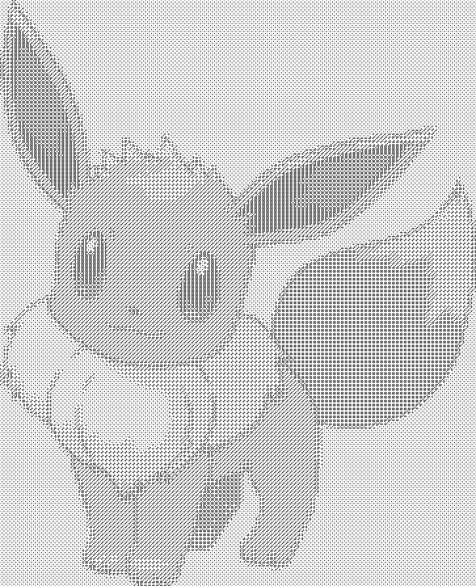

# DiceUp JavaScript [[VIEW LIVE]](https://zyv1k.eu.pythonanywhere.com/diceup)
Recreates provided picture (from file or URL) using 6 sided dice.

##Original:

##Result:

## Tech stack
* JavaScript ES6
* Bootstrap 4
* HTML & CSS

## Installation
1. Open diceup.html
2. Done

"From URL" option might not work locally because of CORS (Cross-Origin Resource Sharing)